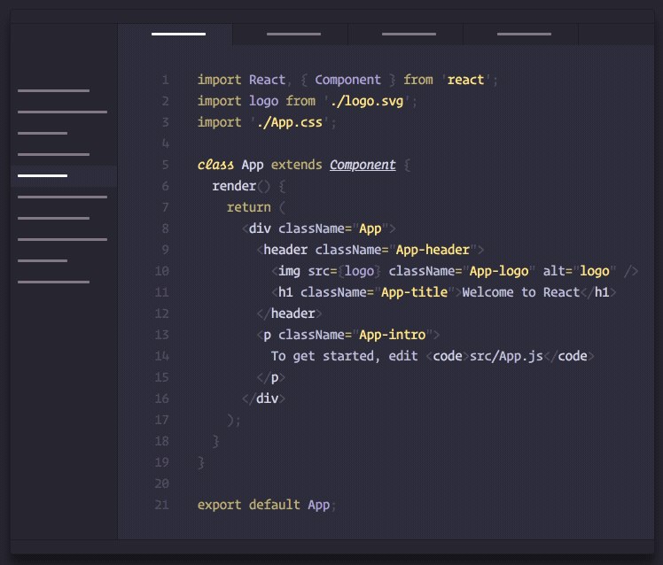

# Polychrome vscode themes

Generated Duotone themes using [polychrome](https://github.com/cdonohue/polychrome) for your entire workbench!

>Inspired by the work done by [@simurai](https://github.com/simurai) and the creation of duotone themes for Atom.

## Features

This extension ships with 2 themes:
* Polychrome Dark
* Polychrome Light 

Simply install the extension and change to either theme. You also can modify the `light` and `dark` theme values to your liking.

## Requirements

You must be running VS Code > version 1.21 for optimal appearance (due to recent changes in the notifications)

## Extension Settings

Make the theme your own by changing `primary`, `accent`, or `background` colors

This extension contributes the following settings:

* `polychrome.dark.primary`: This serves as a base for the dark theme and is mixed with white and the background color to create 2 tints and 2 shades for a total of 5 primary colors. 
* `polychrome.dark.accent`: Brightest accent color for the dark theme. 2 additional accent shades are created by mixing with the background color for 3 total accent colors.
* `polychrome.dark.background`: Determines the base editor background color for the dark theme. This value is then darkened/lightened throughout the UI where appropriate.
* `polychrome.light.primary`: This serves as a base for the light theme and is mixed with black and the background color to create 2 tints and 2 shades for a total of 5 primary colors. 
* `polychrome.light.accent`: Darkest accent color used for the light theme. 2 additional accent shades are created by mixing with the background color for 3 total accent colors.
* `polychrome.light.background`: Determines the base editor background color for the light theme. This value is then darkened/lightened throughout the UI where appropriate.