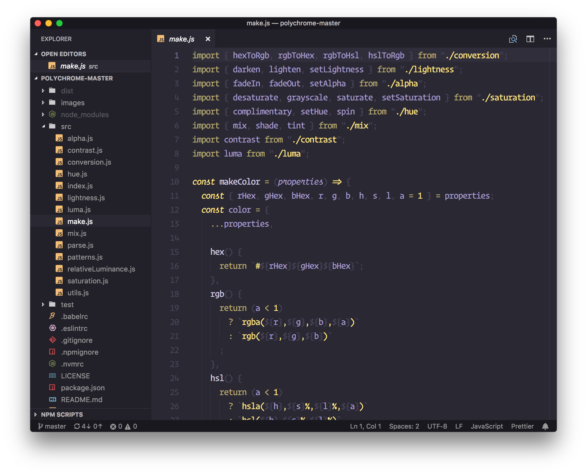
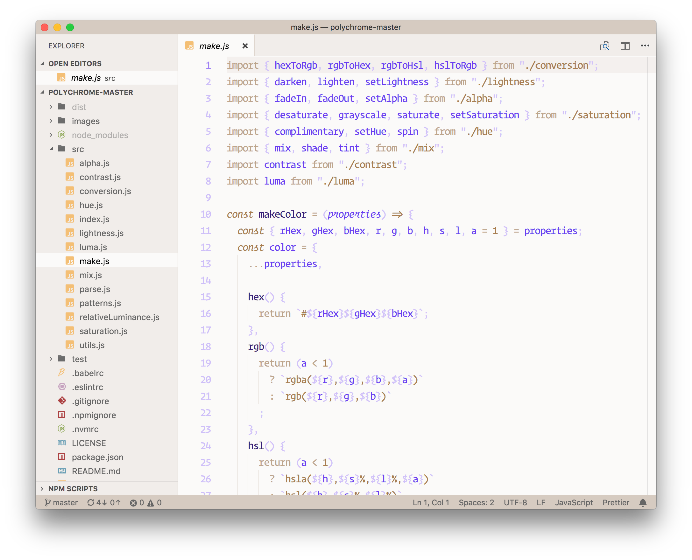

# Polychrome vscode themes

Generated Duotone themes using [polychrome](https://github.com/cdonohue/polychrome) for your entire workbench!

> Inspired by the work done by [@simurai](https://github.com/simurai) and the creation of duotone themes for Atom.

## Features

This extension ships with 2 _base_ themes that can be modified:

### Polychrome Dark

> 

### Polychrome Light

> 

### Create your own

Again, these are the base themes. You can modify the `light` and `dark` theme values in `User Settings` to your liking to create a custom duotone theme of your own.

You can also head over to the [Polychrome Theme Viewer](https://polychrome-vscode-preview.netlify.com) to try out different color combinations before updating your user settings.

## How does this work?

You simply provide a `background`, `primary`, and `accent` color. After that, the extension generates a duotone theme the contains shades and tints of your chosen colors.

## Known Issues

When the theme is updated through the extensions view, there is a chance that your theme colors will reset if you have modified the `dark` or `light` settings for the theme. If you find that this is the case, simply run `Polychrome: Generate Dark/Light Themes` from the command palette. This command will use the user settings values and regenerate your theme files.

> I hope to work with the VS Code team to add some sort of `:onupdate` hook that can run for extensions needing to do any local cleanup when an update happens.

## Requirements

You must be running VS Code > version 1.21 for optimal appearance (due to recent changes in the notifications)

## Extension Settings

Make the theme your own by changing `primary`, `accent`, or `background` colors

This extension contributes the following settings:

* `polychrome.dark.primary`: This serves as a base for the dark theme and is mixed with white and the background color to create 2 tints and 2 shades for a total of 5 primary colors.
* `polychrome.dark.accent`: Brightest accent color for the dark theme. 2 additional accent shades are created by mixing with the background color for 3 total accent colors.
* `polychrome.dark.background`: Determines the base editor background color for the dark theme. This value is then darkened/lightened throughout the UI where appropriate.
* `polychrome.light.primary`: This serves as a base for the light theme and is mixed with black and the background color to create 2 tints and 2 shades for a total of 5 primary colors.
* `polychrome.light.accent`: Darkest accent color used for the light theme. 2 additional accent shades are created by mixing with the background color for 3 total accent colors.
* `polychrome.light.background`: Determines the base editor background color for the light theme. This value is then darkened/lightened throughout the UI where appropriate.
